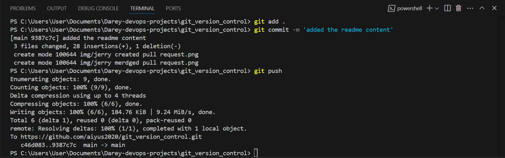

<<<<<<< HEAD
# Basic Git Commands for Tom & Jerry

## Adding Changes
```sh
# Check status of changes
git status
```


```sh
# Add specific files to the staging area
git add index.html
```


## Committing Changes
```sh
# Commit changes with a meaningful message
git commit -m "Update navigation bar"
```


## Creating and Switching Branches
```sh
# Create and switch to a new branch
git checkout -b add-contact-info
```


## Staging and Committing Changes
```sh
# Add specific files to the staging area
git add index.html
```


```sh
# Commit changes with a descriptive message
git commit -m "Add contact information"
```


## Pushing Changes
```sh
# Push the new branch to the remote repository
git push origin add-contact-info
```


## Tom Branch
- tom request to merge his branch

 - tom branch merdged
 

 ## jerry Branch

 - jerry conflict
 

 - jerry conflict resolved
 

 - jerry request merge

 

 - jerry branch merge
 
 
## Best Practices
- Always pull the latest changes before starting work.
- Use clear and descriptive commit messages.
- Keep branches well-organized and regularly clean up merged branches.
- Resolve conflicts carefully and test changes before pushing.

**Happy Coding! 🚀*
=======
<<<<<<< HEAD
# Project Collaboration

## Team Members
- **Tom**: Updated the navigation bar.
- **Jerry**: Added contact information.

## Branch Workflow
1. **Tom's Update:**
   - Created a branch named `updated-navigation`.
   
   - Updated the navbar.
   - Pushed the changes to the repository.
   - Merged `updated-navigation` into `main`.
   
   

2. **Jerry's Update:**
   - Created a branch named `add-contact-info`.
   
   - Added contact information.
   - Pushed the changes to the repository.
   - Merged `add-contact-info` into `main`.
   
   
## Current Status
All updates have been successfully merged into the `main` branch, ensuring both the navigation bar and contact information are up to date.



=======
# devops-3mtt
>>>>>>> d08c0766e75cb81515c4af1fbecac472974837f2
>>>>>>> 8b9d47582ac1c6684e71f51b189dcafb2c6e0204
